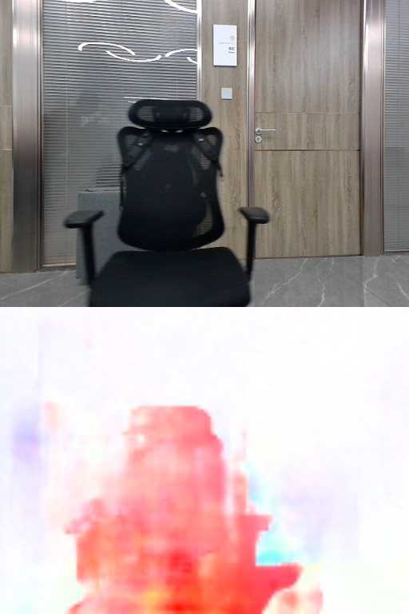

English| [简体中文](./README_cn.md)

Getting Started with mono pwcnet
=======

# Feature Introduction

The mono pwcnet package is a usage example based on PwcNet quantification deployment. The image data comes from local image feedback and subscribed image msg. PwcNet requires providing two images and calculating the optical flow of the first image. 

In this example, we provide two deployment methods:
-Local image for optical flow calculation: Use two local images to perform the optical flow calculation of the first image.
-Subscription image for optical flow calculation: Subscribe to the image information and continuously calculate the optical flow of the first frame in consecutive pairs of images.

# Development Environment

- Programming Language: C/C++
- Development Platform: X5
- System Version: Ubuntu 22.04
- Compilation Toolchain: Linaro GCC 11.4.0

# Compilation

- X5 Version: Supports compilation on the X5 Ubuntu system and cross-compilation using Docker on a PC.

It also supports controlling the dependencies and functionality of the compiled pkg through compilation options.

## Dependency Libraries

- OpenCV: 3.4.5

ROS Packages:

- ai_msgs
- cv_bridge
- dnn node
- hobot_cv
- hbm_img_msgs
- sensor_msgs

hbm_img_msgs is a custom image message format used for image transmission in shared memory scenarios. The hbm_img_msgs pkg is defined in hobot_msgs; therefore, if shared memory is used for image transmission, this pkg is required.

## Compilation Options

1. SHARED_MEM

- Shared memory transmission switch, enabled by default (ON), can be turned off during compilation using the -DSHARED_MEM=OFF command.
- When enabled, compilation and execution depend on the hbm_img_msgs pkg and require the use of tros for compilation.
- When disabled, compilation and execution do not depend on the hbm_img_msgs pkg, supporting compilation using native ROS and tros.
- For shared memory communication, only subscription to nv12 format images is currently supported.## Compile on X3/Rdkultra Ubuntu System

1. Compilation Environment Verification

- The X5 Ubuntu system is installed on the board.
- The current compilation terminal has set up the TogetherROS environment variable: `source PATH/setup.bash`. Where PATH is the installation path of TogetherROS.
- The ROS2 compilation tool colcon is installed. If the installed ROS does not include the compilation tool colcon, it needs to be installed manually. Installation command for colcon: `pip install -U colcon-common-extensions`.
- The dnn node package has been compiled.

2. Compilation

- Compilation command: `colcon build --packages-select mono_pwcnet`

## Docker Cross-Compilation for X5 Version

1. Compilation Environment Verification

- Compilation within docker, and TogetherROS has been installed in the docker environment. For instructions on docker installation, cross-compilation, TogetherROS compilation, and deployment, please refer to the README.md in the robot development platform's robot_dev_config repo.
- The dnn node package has been compiled.
- The hbm_img_msgs package has been compiled (see Dependency section for compilation methods).

2. Compilation

- Compilation command:

  ```shell
  # RDK X5
  bash robot_dev_config/build.sh -p X5 -s mono_pwcnet
  ```

- Shared memory communication method is enabled by default in the compilation options.


## Notes


# Instructions

## Dependencies

- mipi_cam package: Publishes image messages
- usb_cam package: Publishes image messages
- websocket package: Renders images and AI perception messages

## Parameters

| Parameter Name      | Explanation                            | Mandatory            | Default Value       | Remarks                                                                 |
| ------------------- | -------------------------------------- | -------------------- | ------------------- | ----------------------------------------------------------------------- |
| cache_img_limit          | Set the length of the image buffer for caching            | No                   | 11                   |                                                                         |
| cache_task_limit          | Set the length of the task buffer for caching            | No                   | 8                   |                                                                         |
| feed_type          | Image source, 0: local; 1: subscribe            | No                   | 0                   |                                                                         |
| image_file_              | Local image path                          | No                   | {"config/img001.jpg", "config/img002.jpg"}     |                                                                         |
| is_shared_mem_sub  | Subscribe to images using shared memory communication method        | No                   | 0                   |                                                                         |
| dump_render_img    | Whether to render, 0: no; 1: yes            | No                   | 0                   |                                                                         |
| ai_msg_pub_topic_name | Topic name for publishing intelligent results for web display | No                   | /hobot_pwcnet | |
| ros_img_sub_topic_name | Topic name for subscribing image msg | No                   | /image | |
| ros_string_sub_topic_name | Topic name for subscribing string msg to change detect types | No                   | /target_words | |


## Running

## Running on X5 Ubuntu System

Running method 1, use the executable file to start:
```shell
export COLCON_CURRENT_PREFIX=./install
source ./install/local_setup.bash
# The config includes models used by the example and local images for filling
# Copy based on the actual installation path (the installation path in the docker is install/lib/mono_pwcnet/config/, the copy command is cp -r install/lib/mono_pwcnet/config/ .).
cp -r install/lib/mono_pwcnet/config/ .

# Run mode 1:Use local JPG format images for backflow prediction:

ros2 run mono_pwcnet mono_pwcnet --ros-args -p image_file:=["config/img001.jpg","config/img002.jpg"] -p dump_render_img:=1

```

Running method 2, use a launch file:

```shell
export COLCON_CURRENT_PREFIX=./install
source ./install/setup.bash
# Copy the configuration based on the actual installation path
cp -r install/lib/mono_pwcnet/config/ .

# Configure MIPI camera
export CAM_TYPE=usb

# Mode 1: Start the launch file, run pwcnet node.
ros2 launch mono_pwcnet pwcnet.launch_test.py pwcnet_dump_render_img:=0

```

## Run on X86 Ubuntu system:
```shell
export COLCON_CURRENT_PREFIX=./install
source ./install/setup.bash
# Copy the model used in the config as an example, adjust based on the actual installation path
cp -r ./install/lib/mono_pwcnet/config/ .

export CAM_TYPE=fb

# Mode 1: Start the launch file, run pwcnet node.
ros2 launch mono_pwcnet pwcnet.launch_test.py

```

# Results Analysis

## X5 Results Display

log:

Command executed: `ros2 run mono_pwcnet mono_pwcnet --ros-args -p image_file:=["config/img001.jpg","config/img002.jpg"] -p dump_render_img:=1`

```shell
[WARN] [0000000297.873178433] [mono_pwcnet]: Parameter:
 cache_img_limit: 11
 cache_task_limit: 8
 dump_render_img: 1
 feed_type(0:local, 1:sub): 0
 image_size: 2
 is_shared_mem_sub: 1
 is_sync_mode: 0
 ai_msg_pub_topic_name: /hobot_pwcnet
 ros_img_sub_topic_name: /image
 flow_img_pub_topic_name_: /pwcnet_img
[INFO] [0000000297.873456225] [hobot_yolo_world]: Set node para.
[WARN] [0000000297.873504933] [mono_pwcnet]: model_file_name_: config/model.hbm, task_num: 4
[INFO] [0000000297.873555391] [dnn]: Node init.
[INFO] [0000000297.873584641] [hobot_yolo_world]: Set node para.
[WARN] [0000000297.873612475] [mono_pwcnet]: model_file_name_: config/model.hbm, task_num: 4
[INFO] [0000000297.873659350] [dnn]: Model init.
[BPU_PLAT]BPU Platform Version(1.3.6)!
[HBRT] set log level as 0. version = 3.15.49.0
[DNN] Runtime version = 1.23.8_(3.15.49 HBRT)
[W][DNN]bpu_model_info.cpp:491][Version](1970-01-01,00:04:58.68.583) Model: pwcnet_pwcnetneck_flyingchairs. Inconsistency between the hbrt library version 3.15.49.0 and the model build version 3.15.54.0 detected, in order to ensure correct model results, it is recommended to use compilation tools and the BPU SDK from the same OpenExplorer package.
[INFO] [0000000298.069318683] [dnn]: The model input 0 width is 512 and height is 384
[INFO] [0000000298.069524058] [dnn]:
Model Info:
name: pwcnet_pwcnetneck_flyingchairs.
[input]
 - (0) Layout: NCHW, Shape: [1, 6, 384, 512], Type: HB_DNN_TENSOR_TYPE_S8.
[output]
 - (0) Layout: NCHW, Shape: [1, 2, 96, 128], Type: HB_DNN_TENSOR_TYPE_S32.

[INFO] [0000000298.069600891] [dnn]: Task init.
[INFO] [0000000298.071799891] [dnn]: Set task_num [4]
[WARN] [0000000298.071860266] [hobot_yolo_world]: Get model name: pwcnet_pwcnetneck_flyingchairs from load model.
[INFO] [0000000298.071901308] [pwcnet_node]: The model input width is 512 and height is 384
[INFO] [0000000298.174975975] [mono_pwcnet]: [channel]: 2;  [height]: 96; [width]: 128; [quantiType]: 2; scale[0]: 0.00027313; scale[1]: 0.000285034
[INFO] [0000000298.184596600] [PwcNet]: Draw result to file: render_pwcnet_feedback_0_0.jpeg
```

## Render img:


Note: Preprocessing Image involves scaling and padding.